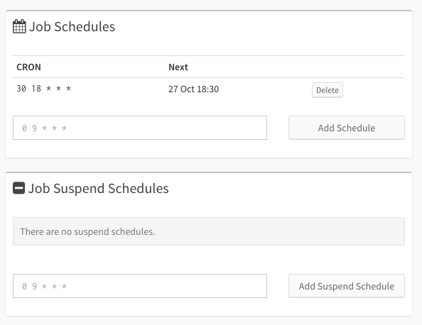

# User Guide

## How to define a job?

### 1. Access the kuroko2 web console.

### 2. Click on "Create new" link within left sidebar.

### 3. Fill in the form:

- Name ... The name of the job.
- Description ... A description of the job.
- Script ... Definition of a workflow, will be explained later.
- Slack channel / Hipchat room ... A chat room to send a message.
- Next Job Execution ... Check if you want to prevent multiple instances of same jobs.


### 4. Click the "Create Job definition" button.


## Job Scheduling

1. Visit the job definition details.
2. Enter a value in the format of a cron command in the job schedules field.
3. Click "Add Schedule".



[note] Job Suspend Schedules is schedules that suspend scheduled jobs.

## Job Script

### DSL

Kuroko2 has a DSL for defining a custom workflow. Here is a basic example:

```
# This is a single line comment
env: DRY_RUN=1
execute: echo 'Hello'
```

the `execute` task launches specified command. Workflow engine executes next line if it succeeded or stop the workflow if it failed.
For more information, see [tasks.md](tasks.md) and [Defining Workflow](#defining-workflow) section.

### Defining Workflow

#### bundle tasks in one job definitions.

Doing tasks by sequencial.

```
my_project_runner: MyProject::Task1.run
my_project_runner: MyProject::Task2.run
```

when error occurs, the job stops and we can choose Cancel or Skip or Retry.

 Action | Description
--------|------------------------------------------------------------------------------------------------------------------------------
 Cancel | Stop all steps in the job.
 Retry  | Execute from failed step.
 Skip   | Ignore the failed step and execute from next step.


## Job Status Flow


 Status | Description
--------|------------------------------------------------------------------------------
WORKING | A job is working.
ERROR   | Your tasks finished with non-zero exit status.
SUCCESS | Your tasks finished with the zero exit status (final state)
CANCEL  | Press the cancel button or prevent running by kuroko2 system. (final state)

## Next Job Execution

* Always launch next job (allow parallel execution)
* Prevent if current job is WORKING or ERROR
* Prevent if current job is WORKING
* Prevent if current job is ERROR

[note] "ERROR" is not a final state. You should cancel or retry "ERROR" state jobs. If your "ERROR" state job don't need treat carefully, you may want to add a `auto_skip_error` task in your job script.

## Notification

Kuroko2 notifies job statuses by below methods.

- Mail
- Slack
- Hipchat
- Webhook

### Notifications Frequency Options

You can configurable notifications frequency.

#### Notify all event to Slack/Hipchat/Webhook

If you enable this option, Kuroko2 notifies all events by Slack/Hipchat/Webhook (except Email) that jobs state is changed,
Events is below.

- The job is launched
- The tasks is skipped.
- The tasks is retried.
- The job becomes error state.
- The job is canceled.
- The job is finished successfully.

If you disable this option, Kuroko2 notifies only the error or critical situation.

#### Notify administrators when the job is cancelled by system.

If you enable this option, Kuroko2 notifies messages that the scheduled job prevented by Kuroko2 in accordance with the "Next Job Execution" options.

### Webhook

Kuroko2 includes additional HTTP headers with webhook POST request.

 Request header       | description
----------------------|-----------------------------------------------------------
 X-Kuroko2-Id         | Unique ID for the event.
 X-Kuroko2-Signature  | HMAC hex digest using secret_token (if configured)


#### Request Example

```json
POST /webhook_endpoint_you_configured HTTP/1.1

Host: localhost:4567
X-Kuroko2-Id: dd03409e-135c-4de4-8bcb-b6ca09c64624
X-Kuroko2-Signature: sha256=48969b34a3d9979d83a9a13b74d20575b03a12f16e7071e3db2148fe182c8b7e
User-Agent: Kuroko2-Webhook
Content-Type: application/json
Content-Length: 537


{
  "action":"notify_finished",
  "level":"SUCCESS",
  "subject":"Finished to execute 'Test Job1'",
  "message":null,
  "job_instance":{
    "url":"http://localhost/definitions/1/instances/100",
    "id":4472,
    "script":"noop:\r\n",
    "finished_at":"2016-11-10T15:39:10+09:00",
    "canceled_at":null,
    "error_at":null,
    "created_at":"2016-11-10T15:38:38+09:00"
  },
  "job_definition":{
    "url":"http://localhost/definitions/1",
    "id":128,
    "name":"noop job1",
    "description":"noop"
  }
}
```


#### Verifying Request Signatures

To verify a webhook request, compare that to the value of the X-Kuroko2-Signature header.

Ruby and Sinatra example is below.

```ruby
require 'openssl'

post '/' do
  body = request.body.read
  if valid_signature?(body)
    'ok'
  else
    'ng'
  end
end


def valid_signature?(body)
  algorithm, signature = request.env['HTTP_X_KUROKO2_SIGNATURE'].split('=')
  Rack::Utils.secure_compare(signature, OpenSSL::HMAC.hexdigest(OpenSSL::Digest.new(algorithm), ENV['KUROKO2_SECRET_TOKEN'], body))
end
```

## Environment Variables

  Environment variable      | ex.
----------------------------|----------------------------------
KUROKO2_JOB_DEFINITION_ID   | "137"
KUROKO2_JOB_DEFINITION_NAME | "My daily job sample"
KUROKO2_LAUNCHED_TIME       | "2016-04-20T16:29:57.302+09:00"
KUROKO2_JOB_INSTANCE_ID     | "100"

* those environment variables kept same value until the job reaches to final("SUCCESS" or "CANCEL") state.

## Execution Logs

TODO
